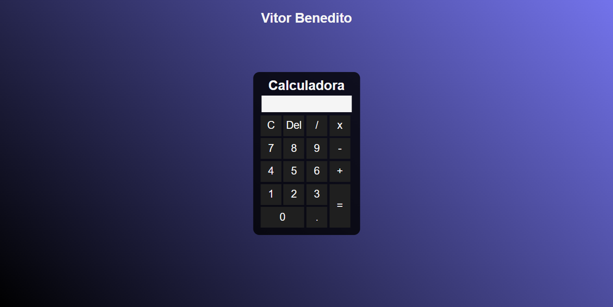

- Primeira calculadora - Junho 2021, por Vitor Benedito

Elementos:

- Tables

Projeto: 

- Calculadora

  

Dificuldades enfrentadas:

Por ser um dos primeiros contatos com Javascript, tive como aprendizado receber os dados e tratar-los para calcular o resultado.